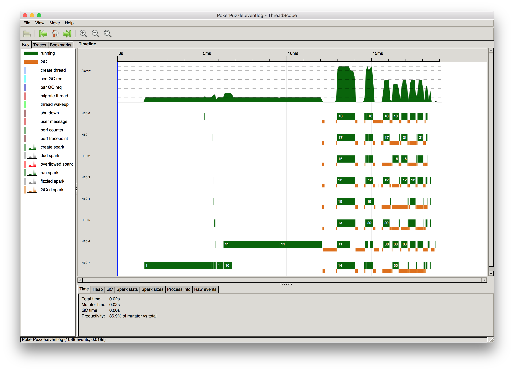

[](https://travis-ci.org/exeter-fp/poker-puzzle)

# Haskell solution for Project Euler Poker puzzle

Built using [Haskell for Mac](http://haskellformac.com).

The key files are:

* [`Model.hs`](https://github.com/exeter-fp/poker-puzzle/blob/master/Nick-Haskell/PokerPuzzle.hsproj/Model.hs)
* [`Parsing.hs`](https://github.com/exeter-fp/poker-puzzle/blob/master/Nick-Haskell/PokerPuzzle.hsproj/Parsing.hs)
* [`PokerPuzzle.hs`](https://github.com/exeter-fp/poker-puzzle/blob/master/Nick-Haskell/PokerPuzzle.hsproj/PokerPuzzle.hs) - this is where the bulk of the code lives
* [`Main.hs`](https://github.com/exeter-fp/poker-puzzle/blob/master/Nick-Haskell/PokerPuzzle.hsproj/Main.hs)

All other files are [Haskell for Mac](http://haskellformac.com) workspace or boiler-plate files.

## Command-line building

From [Deploying Haskell for Mac projects on OS X and Linux](http://blog.haskellformac.com/blog/deploying-haskell-for-mac-projects-on-os-x-and-linux):

1. Download a [stack binary](https://www.haskellstack.org)
2. Execute the following shell commands:

```bash
$ cd PokerPuzzle.hsproj
$ stack setup --no-system-ghc
$ stack build
```

now run it

```bash
$ stack exec PokerPuzzle
```

```
Player 1 has won 376 times
```

load in `ghci`:

```bash
$ stack ghci --ghci-options -XOverloadedStrings
```

```
GHCi, version 7.10.3: http://www.haskell.org/ghc/  :? for help
[1 of 3] Compiling Model            ( Model.hs, interpreted )
[2 of 3] Compiling Parsing          ( Parsing.hs, interpreted )
[3 of 3] Compiling PokerPuzzle      ( PokerPuzzle.hs, interpreted )
Ok, modules loaded: PokerPuzzle, Model, Parsing.
[4 of 4] Compiling Main             ( Main.hs, interpreted )
Ok, modules loaded: PokerPuzzle, Model, Parsing, Main.

λ> main
Player 1 has won 376 times

λ> isPlayer1Winner $ parseLine "5H 5C 6S 7S KD 2C 3S 8S 8D TD"
False
λ> isPlayer1Winner $ parseLine "5D 8C 9S JS AC 2C 5C 7D 8S QH"
True
λ> isPlayer1Winner $ parseLine "2D 9C AS AH AC 3D 6D 7D TD QD"
False
λ> isPlayer1Winner $ parseLine "4D 6S 9H QH QC 3D 6D 7H QD QS"
True
λ> isPlayer1Winner $ parseLine "2H 2D 4C 4D 4S 3C 3D 3S 9S 9D"
True
λ> parseLine "2H 2D 4C 4D 4S 3C 3D 3S 9S 9D"
(Hand {cards = [Card {value = Two, suit = Heart},Card {value = Two, suit = Diamond},Card {value = Four, suit = Club},Card {value = Four, suit = Diamond},Card {value = Four, suit = Spade}]},Hand {cards = [Card {value = Three, suit = Club},Card {value = Three, suit = Diamond},Card {value = Three, suit = Spade},Card {value = Nine, suit = Spade},Card {value = Nine, suit = Diamond}]})
λ> 
```

## Thoughts on the implementation

### Making invalid states unrepresentable

I use tuples to represent the cards associated with a rank so for example in the following:

```haskell
ThreeOfAKind (Card, Card, Card) Kickers
```
... it's clear that only three cards are relevant to the rank. Note however the type system is not enforcing that the cards have equal value so invalid states are still representable, but I'd argue its a small useful step in the right direction.

### Letting `Ord` find the solution

The solution is implemented as:

```haskell
isPlayer1Winner :: (Hand, Hand) -> Bool
isPlayer1Winner (player1Hand, player2Hand) =
  let
     player1Result = pokerResult player1Hand
     player2Result = pokerResult player2Hand
  in
    player1Result > player2Result
```

The simplicity of  `player1Result > player2Result` relies on:

1) Ignoring the `Suit` when ordering cards:

```haskell
instance Ord Card where
  (Card value1 _) `compare` (Card value2 _) = value1 `compare` value2
```

2) Including the kickers in 'PokerResult' so that if two results match the kickers are compared. Note the kickers are ordered high to low.


### Monadic `do` verses applicative style
I experimented with how to deal with Maybe values, first using monadic do:

```haskell
onePair :: GroupedHand -> Maybe PokerResult
onePair (GroupedHand groups) = do 
    pair <- find ((==2) . length) groups
    let remainingCards = reverse $ concat $ filter (/=pair) groups
    return $ OnePair (cardsTuple2 pair) remainingCards
```

Then similar code written in an Applicative style:

```haskell
threeOfAKind :: GroupedHand -> Maybe PokerResult
threeOfAKind (GroupedHand groups) =
  let 
    triplet = cardsTuple3 <$> find ((==3) . length) groups
    remainingCards = reverse $ concat $ filter ((/=3) . length) groups
  in
    ThreeOfAKind <$> triplet <*> pure remainingCards 
```

... I think I prefer the applicative style; though I feel its less beginner friendly.

### Explicit `if..then..else` verses `<$` & `guard`

Compare:

```haskell
twoPairs :: GroupedHand -> Maybe PokerResult
twoPairs (GroupedHand groups) = 
  let
    allTwos = filter ((==2) . length) groups
    pair1 = cardsTuple2 $ allTwos !! 0
    pair2 = cardsTuple2 $ allTwos !! 1
    otherCard = head $ filter ((==1) . length) groups
  in
    if (length allTwos == 2) then Just (TwoPairs pair1 pair2 otherCard) else Nothing
 ```
 
with:

```haskell
twoPairs :: GroupedHand -> Maybe PokerResult
twoPairs (GroupedHand groups) = 
  let
    allTwos = filter ((==2) . length) groups
    pair1 = cardsTuple2 $ allTwos !! 0
    pair2 = cardsTuple2 $ allTwos !! 1
    otherCard = head $ filter ((==1) . length) groups
  in 
    (TwoPairs pair1 pair2 otherCard) <$ guard (length allTwos == 2)
 ```
 The `guard` version is more idomatic, but again I think less beginner friendly.
 
### Laziness

The implementation of `twoPairs` above relies on laziness; only if `(length allTwos == 2)` is `True` will the pairs be extracted from the array.

The laziness in following snippet from `pokerResult`, means that evaluation will stop as soon as valid rank is found; all lower ranks remain unevaluated:

```haskell
    options = [
        royalFlush sortedHand
      , straightFlush sortedHand
      , fourOfAKind groupedHand
      , fullHouse groupedHand
      , flush sortedHand
      , straight sortedHand
      , threeOfAKind groupedHand
      , twoPairs groupedHand
      , onePair groupedHand
      , Just $ highCard sortedHand
      ]
      
    best = find isJust options
```
In this case it won't matter much if they were all evaluated eagerly as the implementations are trivial, but in the case were the evaluations were computationally expensive, laziness provides a simple elegant implementation.

### `Data.Text.Lazy.IO`
Ensure that the file is read as needed; it doesn't load the whole of `p054_poker.txt` in memory at once.

## Alternative Haskell implementations
* https://wiki.haskell.org/Euler_problems/51_to_60#Problem_54
* https://codereview.stackexchange.com/questions/110867/project-euler-problem-54-in-haskell

## Parallelising the solution 

To make the solution run in parallel I've changed [`Main.hs`](https://github.com/exeter-fp/poker-puzzle/blob/master/Nick-Haskell/PokerPuzzle.hsproj/Main.hs) from:

```haskell
   let numPlayer1Wins = length $ filter isPlayer1Winner hands
```

to:

```haskell
  let player1Wins = map (boolToInt. isPlayer1Winner) hands `using` parList rseq
  let numPlayer1Wins = sum player1Wins
```

### Build and test the parallel version

Build using the threaded runtime and turn on optimisations:

```bash
$ stack clean
$ stack build --ghc-options -threaded --ghc-options -O2
```

Run using three OS threads:

```bash
$ stack exec PokerPuzzle -- +RTS -N3
```
or just use `-N` to use all available OS threads

Output execution diagnostics:

```bash
$ stack exec PokerPuzzle -- +RTS -N -s
```

To build for threadscope:

```bash
$ stack clean
$ stack build --ghc-options -threaded --ghc-options -O2 --ghc-options -rtsopts --ghc-options -eventlog
```

Running threadscope. First run `PokerPuzzle` with the `-l` option to generate an eventlog which can be used be threadscope:

```bash
$ stack exec PokerPuzzle -- +RTS -N -l
```

The run threadscope:

```bash
$ threadscope PokerPuzzle.eventlog 
```



### Performance comparision of the parallel vs serial solution

Disappointingly I saw little difference in the performance of the parallel version verses the sequential version:

| Serial  | Parallel (-N8) |
| ------------- | ------------- |
| 0m0.139s  | 0m0.132s  |
| 0m0.117s  | 0m0.119s  |
| 0m0.119s  | 0m0.118s  |
| 0m0.124s  | 0m0.117s  |
| 0m0.122s  | 0m0.121s  |

The diagnostics show only 10% of the overall work was run in parallel, so perhaps not surprising.

#### Serial version

```
$ stack exec PokerPuzzle -- +RTS -s

Player 1 has won 376 times
      14,626,248 bytes allocated in the heap
         559,320 bytes copied during GC
         320,000 bytes maximum residency (2 sample(s))
          69,624 bytes maximum slop
               2 MB total memory in use (0 MB lost due to fragmentation)

                                     Tot time (elapsed)  Avg pause  Max pause
  Gen  0        27 colls,     0 par    0.001s   0.001s     0.0000s    0.0002s
  Gen  1         2 colls,     0 par    0.000s   0.000s     0.0002s    0.0004s

  INIT    time    0.000s  (  0.000s elapsed)
  MUT     time    0.006s  (  0.007s elapsed)
  GC      time    0.001s  (  0.001s elapsed)
  EXIT    time    0.000s  (  0.000s elapsed)
  Total   time    0.042s  (  0.008s elapsed)

  %GC     time       2.1%  (13.4% elapsed)

  Alloc rate    2,417,961,315 bytes per MUT second

  Productivity  97.6% of total user, 520.9% of total elapsed
```

#### Parallel version

```
$ stack exec PokerPuzzle -- +RTS -N -s
Player 1 has won 376 times
      15,334,144 bytes allocated in the heap
         735,264 bytes copied during GC
         358,288 bytes maximum residency (1 sample(s))
         139,312 bytes maximum slop
               5 MB total memory in use (0 MB lost due to fragmentation)

                                     Tot time (elapsed)  Avg pause  Max pause
  Gen  0         5 colls,     4 par    0.002s   0.001s     0.0002s    0.0005s
  Gen  1         1 colls,     1 par    0.001s   0.000s     0.0004s    0.0004s

  Parallel GC work balance: 10.64% (serial 0%, perfect 100%)

  TASKS: 18 (1 bound, 17 peak workers (17 total), using -N8)

  SPARKS: 1000 (1000 converted, 0 overflowed, 0 dud, 0 GC'd, 0 fizzled)

  INIT    time    0.001s  (  0.001s elapsed)
  MUT     time    0.013s  (  0.004s elapsed)
  GC      time    0.003s  (  0.001s elapsed)
  EXIT    time    0.000s  (  0.000s elapsed)
  Total   time    0.052s  (  0.006s elapsed)

  Alloc rate    1,164,854,451 bytes per MUT second

  Productivity  92.7% of total user, 743.6% of total elapsed

```
